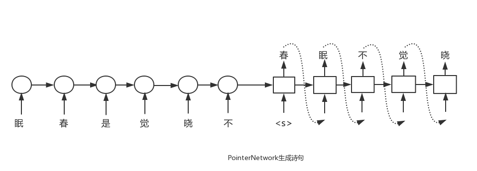

# 诗词九宫格
该项目是2018年百度人工智能创新创意大赛的参赛作品，主要是从诗词九宫格中找出唯一的那一句诗句。


## PointerNet 
Pytorch implementation of Pointer Network - [Link](http://arxiv.org/pdf/1506.03134v1.pdf)


##  poem generation
we use the pointer network to produce the poem. （图中没有画出attention机制）



## corpus generate
[1] 得到以下json格式的古诗数据(poems.txt)

```angular2html
{
 "author": "白居易", 
 "paragraphs": ["静爱青苔院，深宜白鬓翁。", "貌将松共瘦，心与竹俱空。", "暖有低簷日，春多飏幕风。", "平生闲境界，尽在五言中。"],
  "title": "偶題閤下廳", 
  "sents": ["静爱青苔院", "深宜白鬓翁", "貌将松共瘦", "心与竹俱空", "暖有低簷日", "春多飏幕风", "平生闲境界", "尽在五言中"]
}
```
[2] 使用generate.py生成不同难度级别的诗句corpus(2,3,4分别表示9个字来自于2,3,4句诗)，得到resource2、resource3、resource4
```angular2html
python generate.py
```
[3] 合并resource2、resource3、resource4，得到resources_total.

[4] 使用trans_json.py将resource转换成json格式
```angular2html
python trans_json.py
```
[5] 利用百度搜索判断诗句的常见度，给诗句排个顺序。

## result   (on resources_total.json)

models                     |  accuracy  
--------                    |  ----------
1LSTM + LSTM(pre wordvec)       | 
1BiLSTM + LSTM(pre word vec)    | 


